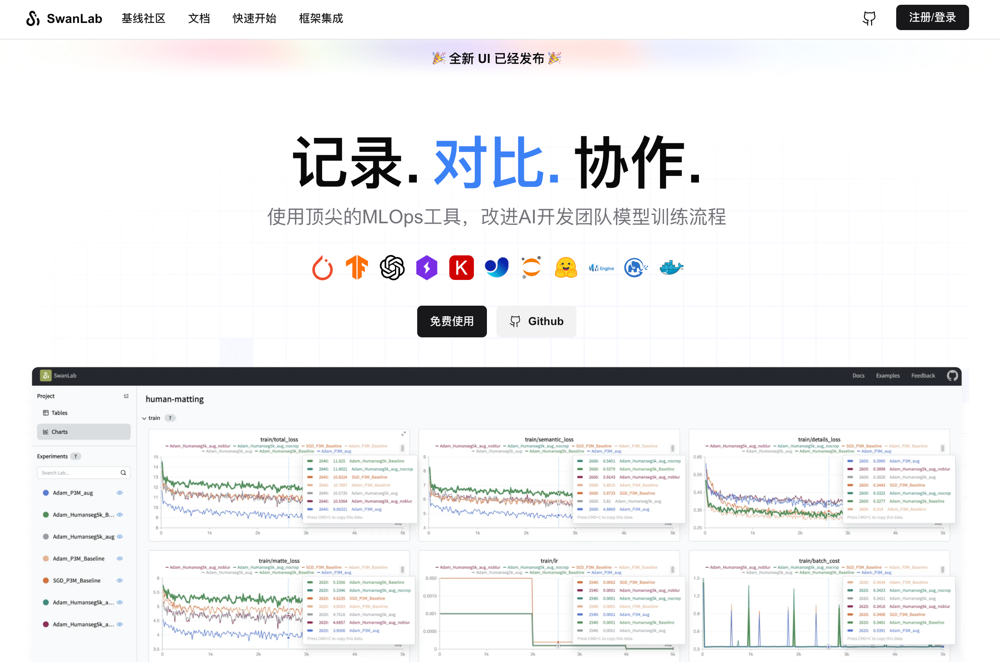
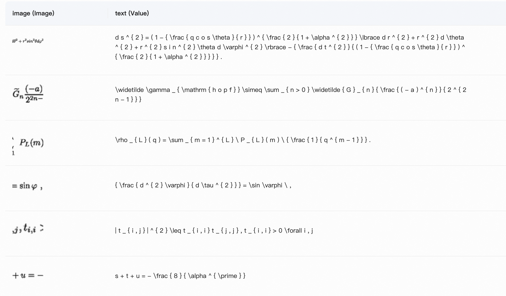
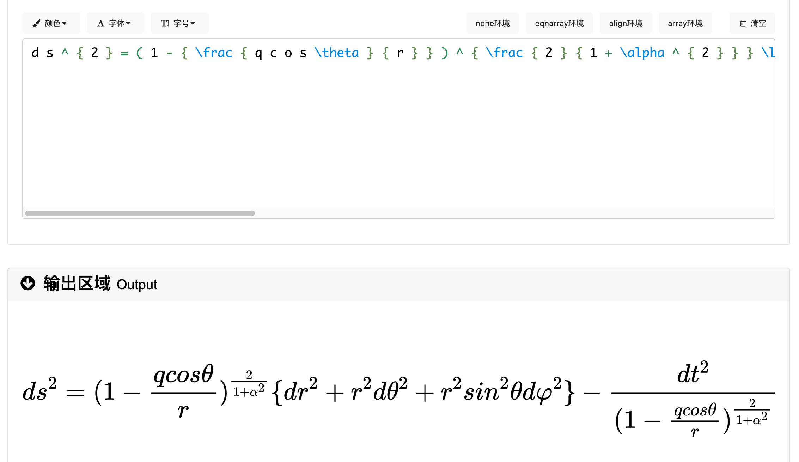
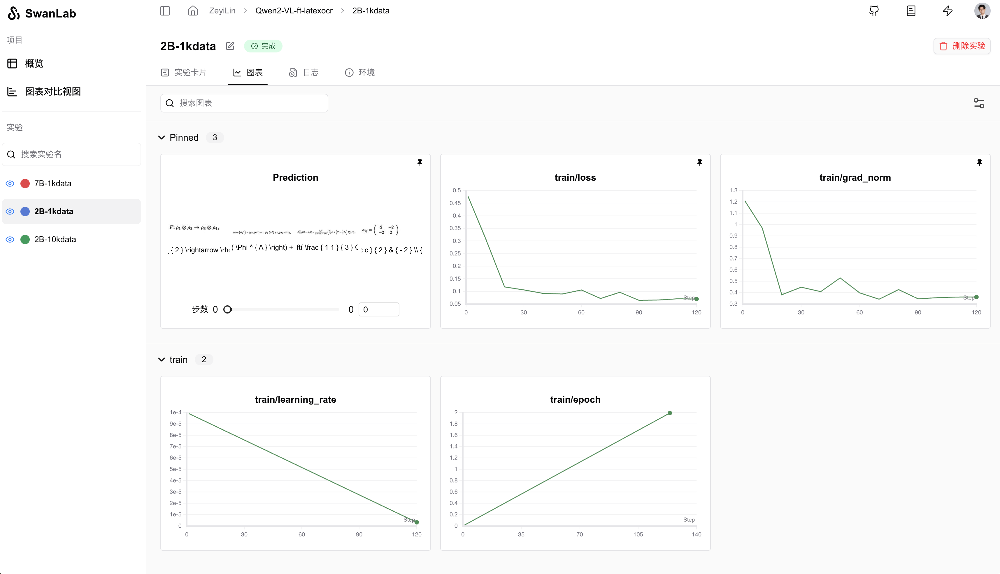
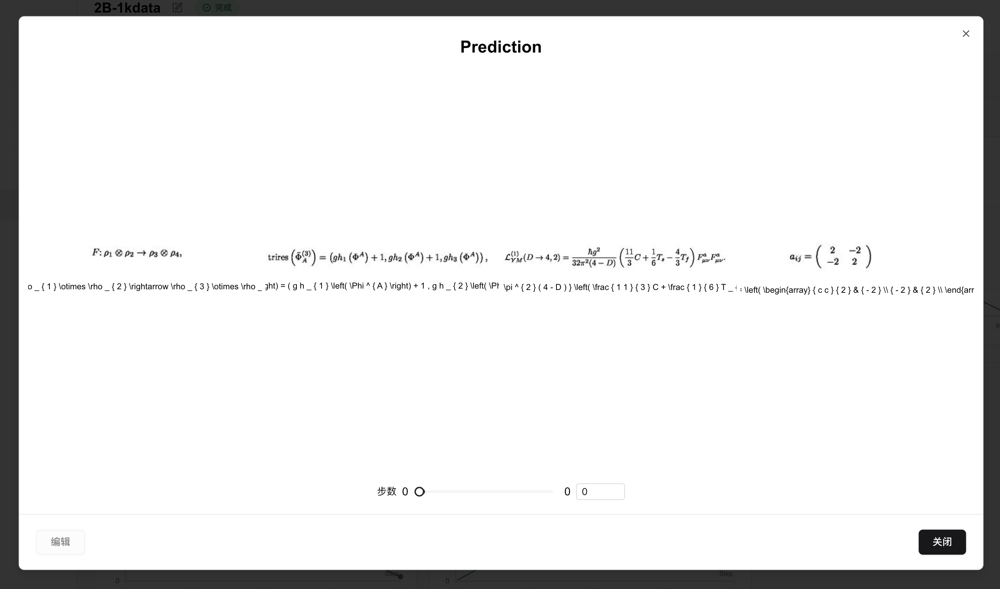
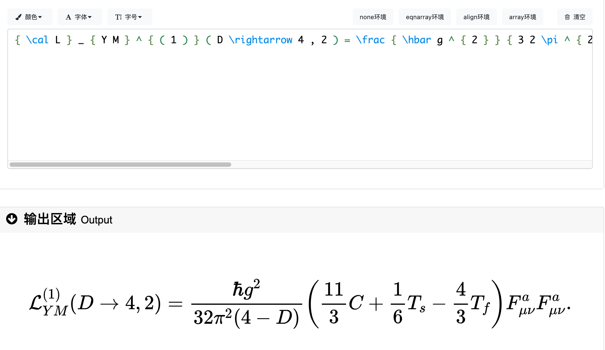
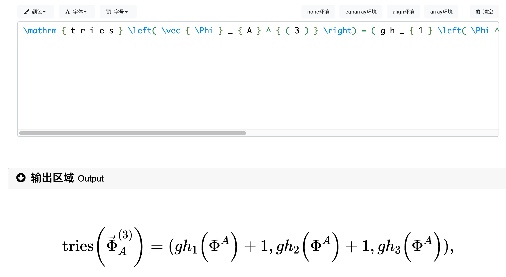
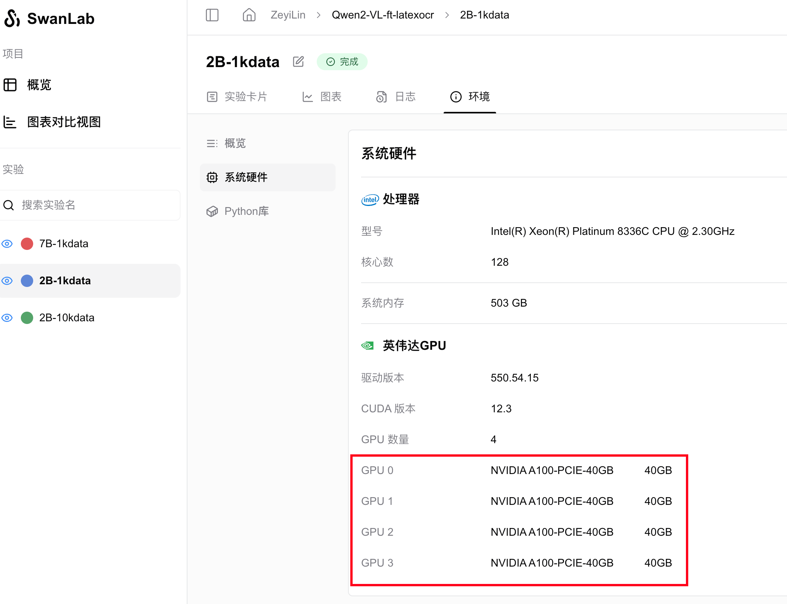

# Qwen2-VL-2B-Instruct Lora 微调案例 - LaTexOCR

[Qwen2-VL](https://link.zhihu.com/?target=https%3A//modelscope.cn/models/qwen/Qwen2-1.5B-Instruct/summary)是通义千问团队最近开源的大语言模型，由阿里云通义实验室研发。

以Qwen2-VL作为基座多模态大模型，通过**指令微调**的方式实现特定场景下的OCR，是学习**多模态LLM微调**的入门任务。


本文我们将简要介绍基于 transformers、peft 等框架，使用 Qwen2-VL-2B-Instruct 模型在**LaTeX\_OCR** 上进行Lora微调训练，同时使用 [SwanLab](https://github.com/swanhubx/swanlab) 监控训练过程与评估模型效果。


* 训练过程：[ZeyiLin/Qwen2-VL-ft-latexocr](https://swanlab.cn/@ZeyiLin/Qwen2-VL-ft-latexocr/runs/1glks73k6u5gw98ovzwev/chart)
* 代码：见此文档同目录下文件夹`06-Qwen2-VL-2B-Instruct Lora微调案例LaTexOCR 参考代码`
* 数据集：[LaTeX_OCR](https://modelscope.cn/datasets/AI-ModelScope/LaTeX_OCR/summary)
* 模型：[Qwen2-VL-2B-Instruct](https://modelscope.cn/models/Qwen/Qwen2-VL-2B-Instruct)
* 在线LaTex公式预览网站：[latexlive](https://www.latexlive.com/)
* 显存占用：约20GB，如显存不足，请调低per_device_train_batch_size


## 目录

- [知识点：视觉大模型微调的场景与用法](#-知识点：视觉大模型微调的场景与用法)
- [SwanLab简介](#-SwanLab简介)
- [环境配置](#-环境配置)
- [准备数据集](#-准备数据集)
- [模型下载与加载](#-模型下载与加载)
- [集成SwanLab](#-集成SwanLab)
- [开始微调（完整代码）](#-开始微调)
- [训练结果演示](#-训练结果演示)
- [推理LoRA微调后的模型](#-推理LoRA微调后的模型)
- [补充](#补充)


# 📖 知识点：视觉大模型微调的场景与用法

视觉大模型是指能够支持**图片/视频输入**的大语言模型，能够极大丰富与LLM的交互方式。

对视觉大模型做微调的一个典型场景，是让它特化成一个更强大、更智能的**计算机视觉模型**，执行图像分类、目标检测、语义分割、OCR、图像描述任务等等。

并且由于视觉大模型强大的基础能力，所以训练流程变得非常统一——无论是分类、检测还是分割，只需要构建好数据对（图像 -> 文本），都可以用同一套代码完成，**相比以往针对不同任务就要构建迥异的训练代码而言，视觉大模型微调要简单粗暴得多，而且效果还更好。**

当然，硬币的另一面是要承担更高的计算开销，但在大模型逐渐轻量化的趋势下，可以预想这种训练范式将逐渐成为主流。


## 👋 SwanLab简介



[SwanLab](https://github.com/swanhubx/swanlab) 是一个开源的模型训练记录工具，常被称为"中国版 Weights&Biases + Tensorboard"。SwanLab面向AI研究者，提供了训练可视化、自动日志记录、超参数记录、实验对比、多人协同等功能。在SwanLab上，研究者能基于直观的可视化图表发现训练问题，对比多个实验找到研究灵感，并通过在线链接的分享与基于组织的多人协同训练，打破团队沟通的壁垒。

**为什么要记录训练？**

相较于软件开发，模型训练更像一个实验科学。一个品质优秀的模型背后，往往是成千上万次实验。研究者需要不断尝试、记录、对比，积累经验，才能找到最佳的模型结构、超参数与数据配比。在这之中，如何高效进行记录与对比，对于研究效率的提升至关重要。

**可视化的价值在哪里？**

机器学习模型训练往往伴随着大量的超参数、指标、日志等数据，很多关键信息往往存在于实验的中间而非结尾，如果不对连续的指标通过图表进行可视化，往往会错失发现问题的最佳时机，甚至错过关键信息。同时不进行可视化，也难以对比多个实验之间的差异。
可视化也为AI研究者提供了良好的交流基础，研究者们可以基于图表进行沟通、分析与优化，而非以往看着枯燥的终端打印。这打破了团队沟通的壁垒，提高了整体的研发效率。


## 🌍 环境配置

环境配置分为三步：

1. 确保你的电脑上至少有一张英伟达显卡，并已安装好了CUDA环境。
2. 安装Python（版本>=3.8）以及能够调用**CUDA加速的PyTorch**。
3. 安装与Qwen2-VL微调相关的第三方库，可以使用以下命令：

```shellscript
python -m pip install --upgrade pip
# 更换 pypi 源，加速库的安装
pip config set global.index-url https://pypi.tuna.tsinghua.edu.cn/simple

pip install modelscope==1.18.0
pip install transformers==4.46.2
pip install sentencepiece==0.2.0
pip install accelerate==1.1.1
pip install datasets==2.18.0
pip install peft==0.13.2
pip install swanlab==0.3.27
pip install qwen-vl-utils==0.0.8
pip install pandas==2.2.2
```


## 📚 准备数据集

本节使用的是 [LaTex\_OCR](https://modelscope.cn/datasets/AI-ModelScope/LaTeX_OCR/summary) 数据集，这个数据集包含了大量的数学公式图片，以及对应的LaTex语法字符串。可以看到，下图中的image就是学术公式图，text就是对应的LaTex语法字符串：



将这些LaTex语法字符串粘贴到[latexlive](https://www.latexlive.com/)中，可以预览对应的数学公式：



了解了数据集结构之后，我们需要做的是将这些数据整理成Qwen2-VL需要的json格式，下面是目标的格式：

```json
[
  {
    "id": "identity_1",
    "conversations": [
      {
        "role": "user",
        "value": "图片路径"
      },
      {
        "role": "assistant",
        "value": "LaTex公式"
      }
    ]  
  },
...
]
```

我们来解读一下这个json：

* **id**：数据对的编号
* **conversations**：人类与LLM的对话，类型是列表
* **role**：角色，user代表人类，assistant代表模型
* **content**：聊天发送的内容，其中user的value是图片路径，assistant的回复是LaTex公式


**接下来让我们下载数据集并进行处理：**

1. **我们需要做四件事情：**
   * 通过Modelscope下载LaTex\_OCR数据集
   * 加载数据集，将图像保存到本地
   * 将图像路径和描述文本转换为一个csv文件
   * 将csv文件转换为json文件，包含1个训练集和验证集
2. **使用下面的代码完成从数据下载到生成csv的过程：**

data2csv.py：

```python
# 导入所需的库
from modelscope.msdatasets import MsDataset
import os
import pandas as pd

MAX_DATA_NUMBER = 1000
dataset_id = 'AI-ModelScope/LaTeX_OCR'
subset_name = 'default'
split = 'train'

dataset_dir = 'LaTeX_OCR'
csv_path = './latex_ocr_train.csv'


# 检查目录是否已存在
if not os.path.exists(dataset_dir):
    # 从modelscope下载COCO 2014图像描述数据集
    ds =  MsDataset.load(dataset_id, subset_name=subset_name, split=split)
    print(len(ds))
    # 设置处理的图片数量上限
    total = min(MAX_DATA_NUMBER, len(ds))

    # 创建保存图片的目录
    os.makedirs(dataset_dir, exist_ok=True)

    # 初始化存储图片路径和描述的列表
    image_paths = []
    texts = []

    for i in range(total):
        # 获取每个样本的信息
        item = ds[i]
        text = item['text']
        image = item['image']
        
        # 保存图片并记录路径
        image_path = os.path.abspath(f'{dataset_dir}/{i}.jpg')
        image.save(image_path)
        
        # 将路径和描述添加到列表中
        image_paths.append(image_path)
        texts.append(text)
        
        # 每处理50张图片打印一次进度
        if (i + 1) % 50 == 0:
            print(f'Processing {i+1}/{total} images ({(i+1)/total*100:.1f}%)')

    # 将图片路径和描述保存为CSV文件
    df = pd.DataFrame({
        'image_path': image_paths,
        'text': texts,
    })

    # 将数据保存为CSV文件
    df.to_csv(csv_path, index=False)
    
    print(f'数据处理完成，共处理了{total}张图片')

else:    
    print(f'{dataset_dir}目录已存在,跳过数据处理步骤')
```

**3. 在同一目录下，用以下代码，将csv文件转换为json文件（训练集+验证集）：**

csv2json.py：

```python
import pandas as pd
import json

csv_path = './latex_ocr_train.csv'
train_json_path = './latex_ocr_train.json'
val_json_path = './latex_ocr_val.json'
df = pd.read_csv(csv_path)
# Create conversation format
conversations = []

# Add image conversations
for i in range(len(df)):
    conversations.append({
        "id": f"identity_{i+1}",
        "conversations": [
            {
                "role": "user",
                "value": f"{df.iloc[i]['image_path']}"
            },
            {
                "role": "assistant", 
                "value": str(df.iloc[i]['text'])
            }
        ]
    })

# print(conversations)
# Save to JSON
# Split into train and validation sets
train_conversations = conversations[:-4]
val_conversations = conversations[-4:]

# Save train set
with open(train_json_path, 'w', encoding='utf-8') as f:
    json.dump(train_conversations, f, ensure_ascii=False, indent=2)

# Save validation set 
with open(val_json_path, 'w', encoding='utf-8') as f:
    json.dump(val_conversations, f, ensure_ascii=False, indent=2)
```

**此时目录下会多出3个文件：**

* latex_ocr_train.csv
* latex_ocr_train.json
* latex_ocr_val.json


至此，我们完成了数据集的准备。


## 🤖 模型下载与加载

这里我们使用modelscope下载Qwen2-VL-2B-Instruct模型，然后把它加载到Transformers中进行训练：

```python
from modelscope import snapshot_download, AutoTokenizer
from transformers import TrainingArguments, Trainer, DataCollatorForSeq2Seq, Qwen2VLForConditionalGeneration, AutoProcessor
import torch

# 在modelscope上下载Qwen2-VL模型到本地目录下
model_dir = snapshot_download("Qwen/Qwen2-VL-2B-Instruct", cache_dir="./", revision="master")

# 使用Transformers加载模型权重
tokenizer = AutoTokenizer.from_pretrained("./Qwen/Qwen2-VL-2B-Instruct/", use_fast=False, trust_remote_code=True)
# 特别的，Qwen2-VL-2B-Instruct模型需要使用Qwen2VLForConditionalGeneration来加载
model = Qwen2VLForConditionalGeneration.from_pretrained("./Qwen/Qwen2-VL-2B-Instruct/", device_map="auto", torch_dtype=torch.bfloat16, trust_remote_code=True,)
model.enable_input_require_grads()  # 开启梯度检查点时，要执行该方法
```

模型大小为 4.5GB，下载模型大概需要 5 分钟。


## 🐦‍ 集成SwanLab

SwanLab与Transformers已经做好了集成，用法是在Trainer的`callbacks`参数中添加`SwanLabCallback`实例，就可以自动记录超参数和训练指标，简化代码如下：

```python
from swanlab.integration.transformers import SwanLabCallback
from transformers import Trainer

swanlab_callback = SwanLabCallback()

trainer = Trainer(
    ...
    callbacks=[swanlab_callback],
)
```

首次使用SwanLab，需要先在[官网](https://swanlab.cn)注册一个账号，然后在用户设置页面复制你的API Key，然后在训练开始提示登录时粘贴即可，后续无需再次登录：


更多用法可参考[快速开始](https://docs.swanlab.cn/zh/guide_cloud/general/quick-start.html)、[Transformers集成](https://docs.swanlab.cn/zh/guide_cloud/integration/integration-huggingface-transformers.html)。


## 🚀 开始微调（完整代码）

查看可视化训练过程：[ZeyiLin/Qwen2-VL-ft-latexocr](https://swanlab.cn/@ZeyiLin/Qwen2-VL-ft-latexocr/runs/1glks73k6u5gw98ovzwev/chart)

**本节代码做了以下几件事：**

1. 下载并加载Qwen2-VL-2B-Instruct模型
2. 加载数据集，取前996条数据参与训练，4条数据进行主观评测
3. 配置Lora，参数为r=64, lora\_alpha=16, lora\_dropout=0.05
4. 使用SwanLab记录训练过程，包括超参数、指标和最终的模型输出结果
5. 训练2个epoch

开始执行代码时的目录结构应该是：

```
|———— train.py
|———— data2csv.py
|———— csv2json.py
|———— latex_ocr_train.csv
|———— latex_ocr_train.json
|———— latex_ocr_val.json
```

**完整代码如下**

train.py：

```python
import torch
from datasets import Dataset
from modelscope import snapshot_download, AutoTokenizer
from swanlab.integration.transformers import SwanLabCallback
from qwen_vl_utils import process_vision_info
from peft import LoraConfig, TaskType, get_peft_model, PeftModel
from transformers import (
    TrainingArguments,
    Trainer,
    DataCollatorForSeq2Seq,
    Qwen2VLForConditionalGeneration,
    AutoProcessor,
)
import swanlab
import json
import os


prompt = "你是一个LaText OCR助手,目标是读取用户输入的照片，转换成LaTex公式。"
model_id = "Qwen/Qwen2-VL-2B-Instruct"
local_model_path = "./Qwen/Qwen2-VL-2B-Instruct"
train_dataset_json_path = "latex_ocr_train.json"
val_dataset_json_path = "latex_ocr_val.json"
output_dir = "./output/Qwen2-VL-2B-LatexOCR"
MAX_LENGTH = 8192

def process_func(example):
    """
    将数据集进行预处理
    """
    input_ids, attention_mask, labels = [], [], []
    conversation = example["conversations"]
    image_file_path = conversation[0]["value"]
    output_content = conversation[1]["value"]
    
    messages = [
        {
            "role": "user",
            "content": [
                {
                    "type": "image",
                    "image": f"{image_file_path}",
                    "resized_height": 500,
                    "resized_width": 100,
                },
                {"type": "text", "text": prompt},
            ],
        }
    ]
    text = processor.apply_chat_template(
        messages, tokenize=False, add_generation_prompt=True
    )  # 获取文本
    image_inputs, video_inputs = process_vision_info(messages)  # 获取数据数据（预处理过）
    inputs = processor(
        text=[text],
        images=image_inputs,
        videos=video_inputs,
        padding=True,
        return_tensors="pt",
    )
    inputs = {key: value.tolist() for key, value in inputs.items()} #tensor -> list,为了方便拼接
    instruction = inputs

    response = tokenizer(f"{output_content}", add_special_tokens=False)


    input_ids = (
            instruction["input_ids"][0] + response["input_ids"] + [tokenizer.pad_token_id]
    )

    attention_mask = instruction["attention_mask"][0] + response["attention_mask"] + [1]
    labels = (
            [-100] * len(instruction["input_ids"][0])
            + response["input_ids"]
            + [tokenizer.pad_token_id]
    )
    if len(input_ids) > MAX_LENGTH:  # 做一个截断
        input_ids = input_ids[:MAX_LENGTH]
        attention_mask = attention_mask[:MAX_LENGTH]
        labels = labels[:MAX_LENGTH]

    input_ids = torch.tensor(input_ids)
    attention_mask = torch.tensor(attention_mask)
    labels = torch.tensor(labels)
    inputs['pixel_values'] = torch.tensor(inputs['pixel_values'])
    inputs['image_grid_thw'] = torch.tensor(inputs['image_grid_thw']).squeeze(0)  #由（1,h,w)变换为（h,w）
    return {"input_ids": input_ids, "attention_mask": attention_mask, "labels": labels,
            "pixel_values": inputs['pixel_values'], "image_grid_thw": inputs['image_grid_thw']}


def predict(messages, model):
    # 准备推理
    text = processor.apply_chat_template(
        messages, tokenize=False, add_generation_prompt=True
    )
    image_inputs, video_inputs = process_vision_info(messages)
    inputs = processor(
        text=[text],
        images=image_inputs,
        videos=video_inputs,
        padding=True,
        return_tensors="pt",
    )
    inputs = inputs.to("cuda")

    # 生成输出
    generated_ids = model.generate(**inputs, max_new_tokens=MAX_LENGTH)
    generated_ids_trimmed = [
        out_ids[len(in_ids) :] for in_ids, out_ids in zip(inputs.input_ids, generated_ids)
    ]
    output_text = processor.batch_decode(
        generated_ids_trimmed, skip_special_tokens=True, clean_up_tokenization_spaces=False
    )
    
    return output_text[0]


# 在modelscope上下载Qwen2-VL模型到本地目录下
model_dir = snapshot_download(model_id, cache_dir="./", revision="master")

# 使用Transformers加载模型权重
tokenizer = AutoTokenizer.from_pretrained(local_model_path, use_fast=False, trust_remote_code=True)
processor = AutoProcessor.from_pretrained(local_model_path)

origin_model = Qwen2VLForConditionalGeneration.from_pretrained(local_model_path, device_map="auto", torch_dtype=torch.bfloat16, trust_remote_code=True,)
origin_model.enable_input_require_grads()  # 开启梯度检查点时，要执行该方法

# 处理数据集：读取json文件
train_ds = Dataset.from_json(train_dataset_json_path)
train_dataset = train_ds.map(process_func)

# 配置LoRA
config = LoraConfig(
    task_type=TaskType.CAUSAL_LM,
    target_modules=["q_proj", "k_proj", "v_proj", "o_proj", "gate_proj", "up_proj", "down_proj"],
    inference_mode=False,  # 训练模式
    r=64,  # Lora 秩
    lora_alpha=16,  # Lora alaph，具体作用参见 Lora 原理
    lora_dropout=0.05,  # Dropout 比例
    bias="none",
)

# 获取LoRA模型
train_peft_model = get_peft_model(origin_model, config)

# 配置训练参数
args = TrainingArguments(
    output_dir=output_dir,
    per_device_train_batch_size=4,
    gradient_accumulation_steps=4,
    logging_steps=10,
    logging_first_step=10,
    num_train_epochs=2,
    save_steps=100,
    learning_rate=1e-4,
    save_on_each_node=True,
    gradient_checkpointing=True,
    report_to="none",
)
        
# 设置SwanLab回调
swanlab_callback = SwanLabCallback(
    project="Qwen2-VL-ft-latexocr",
    experiment_name="7B-1kdata",
    config={
        "model": "https://modelscope.cn/models/Qwen/Qwen2-VL-7B-Instruct",
        "dataset": "https://modelscope.cn/datasets/AI-ModelScope/LaTeX_OCR/summary",
        # "github": "https://github.com/datawhalechina/self-llm",
        "model_id": model_id,
        "train_dataset_json_path": train_dataset_json_path,
        "val_dataset_json_path": val_dataset_json_path,
        "output_dir": output_dir,
        "prompt": prompt,
        "train_data_number": len(train_ds),
        "token_max_length": MAX_LENGTH,
        "lora_rank": 64,
        "lora_alpha": 16,
        "lora_dropout": 0.1,
    },
)

# 配置Trainer
trainer = Trainer(
    model=train_peft_model,
    args=args,
    train_dataset=train_dataset,
    data_collator=DataCollatorForSeq2Seq(tokenizer=tokenizer, padding=True),
    callbacks=[swanlab_callback],
)

# 开启模型训练
trainer.train()

# ====================测试===================
# 配置测试参数
val_config = LoraConfig(
    task_type=TaskType.CAUSAL_LM,
    target_modules=["q_proj", "k_proj", "v_proj", "o_proj", "gate_proj", "up_proj", "down_proj"],
    inference_mode=True,  # 训练模式
    r=64,  # Lora 秩
    lora_alpha=16,  # Lora alaph，具体作用参见 Lora 原理
    lora_dropout=0.05,  # Dropout 比例
    bias="none",
)

# 获取测试模型，从output_dir中获取最新的checkpoint
load_model_path = f"{output_dir}/checkpoint-{max([int(d.split('-')[-1]) for d in os.listdir(output_dir) if d.startswith('checkpoint-')])}"
print(f"load_model_path: {load_model_path}")
val_peft_model = PeftModel.from_pretrained(origin_model, model_id=load_model_path, config=val_config)

# 读取测试数据
with open(val_dataset_json_path, "r") as f:
    test_dataset = json.load(f)

test_image_list = []
for item in test_dataset:
    image_file_path = item["conversations"][0]["value"]
    label = item["conversations"][1]["value"]
    
    messages = [{
        "role": "user", 
        "content": [
            {
            "type": "image", 
            "image": image_file_path,
            "resized_height": 100,
            "resized_width": 500,   
            },
            {
            "type": "text",
            "text": prompt,
            }
        ]}]
    
    response = predict(messages, val_peft_model)
    
    print(f"predict:{response}")
    print(f"gt:{label}\n")

    test_image_list.append(swanlab.Image(image_file_path, caption=response))

swanlab.log({"Prediction": test_image_list})

# 在Jupyter Notebook中运行时要停止SwanLab记录，需要调用swanlab.finish()
swanlab.finish()
```

看到下面的进度条即代表训练开始：


## 💻 训练结果演示

详细训练过程请看这里：[ZeyiLin/Qwen2-VL-ft-latexocr](https://swanlab.cn/@ZeyiLin/Qwen2-VL-ft-latexocr/runs/1glks73k6u5gw98ovzwev/chart)



从SwanLab图表中我们可以看到，学习率的下降策略是线性下降，loss随epoch呈现下降趋势，同时grad\_norm也呈现下降趋势。这种形态反映了模型的训练效果是符合预期的。

在`Prediction`图表中记录着模型最终的输出结果，可以看到模型在回答的风格已经是标准的LaTex语法。



对这四个结果进行验证，跟输入图像完成一致。





那么与没有微调的模型进行效果对比，我们选择997.jpg：


```
没有微调：(10,10),(989,989)
微调后：\mathrm { t r i e s } \left( \vec { \Phi } _ { A } ^ { ( 3 ) } \right) = ( g h _ { 1 } \left( \Phi ^ { A } \right) + 1 , g h _ { 2 } \left( \Phi ^ { A } \right) + 1 , g h _ { 3 } \left( \Phi ^ { A } \right) )
```

可以看到没有微调的模型，对于这张图片的输出明显是错误的；

而微调后的模型，有着非常完美表现：




## 🧐 推理LoRA微调后的模型

加载lora微调后的模型，并进行推理：

```python
from transformers import Qwen2VLForConditionalGeneration, AutoProcessor
from qwen_vl_utils import process_vision_info
from peft import PeftModel, LoraConfig, TaskType

prompt = "你是一个LaText OCR助手,目标是读取用户输入的照片，转换成LaTex公式。"
local_model_path = "./Qwen/Qwen2-VL-2B-Instruct"
lora_model_path = "./output/Qwen2-VL-2B-LatexOCR/checkpoint-124"
test_image_path = "./LaTeX_OCR/997.jpg"

config = LoraConfig(
    task_type=TaskType.CAUSAL_LM,
    target_modules=["q_proj", "k_proj", "v_proj", "o_proj", "gate_proj", "up_proj", "down_proj"],
    inference_mode=True,
    r=64,  # Lora 秩
    lora_alpha=16,  # Lora alaph，具体作用参见 Lora 原理
    lora_dropout=0.05,  # Dropout 比例
    bias="none",
)

# default: Load the model on the available device(s)
model = Qwen2VLForConditionalGeneration.from_pretrained(
    local_model_path, torch_dtype="auto", device_map="auto"
)

model = PeftModel.from_pretrained(model, model_id=f"{lora_model_path}", config=config)
processor = AutoProcessor.from_pretrained(local_model_path)

messages = [
    {
        "role": "user",
        "content": [
            {
                "type": "image",
                "image": test_image_path,
                "resized_height": 100,
                "resized_width": 500,
            },
            {"type": "text", "text": f"{prompt}"},
        ],
    }
]

# Preparation for inference
text = processor.apply_chat_template(
    messages, tokenize=False, add_generation_prompt=True
)
image_inputs, video_inputs = process_vision_info(messages)
inputs = processor(
    text=[text],
    images=image_inputs,
    videos=video_inputs,
    padding=True,
    return_tensors="pt",
)
inputs = inputs.to("cuda")

# Inference: Generation of the output
generated_ids = model.generate(**inputs, max_new_tokens=8192)
generated_ids_trimmed = [
    out_ids[len(in_ids) :] for in_ids, out_ids in zip(inputs.input_ids, generated_ids)
]
output_text = processor.batch_decode(
    generated_ids_trimmed, skip_special_tokens=True, clean_up_tokenization_spaces=False
)

print(output_text[0])
```

##

## 补充

### 详细硬件配置和参数说明

使用4张A100 40GB显卡（总显存占用大约），batch size为4，gradient accumulation steps为4，训练2个epoch的用时为8分钟51秒。




### 注意

* 在微调脚本中，`val_peft_model`加载的是一共固定的checkpoint文件，如果你添加了数据或超参数，请根据实际情况修改checkpoint文件路径。

